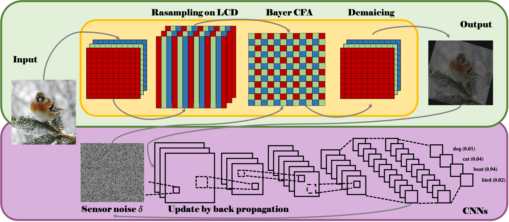

# Moiré Attack (MA): A New Potential Risk of Screen Photos [NeurIPS 2021]

This repository is the official implementation of [Moiré Attack (MA): A New Potential Risk of Screen Photos](https://arxiv.org/abs/2030.12345). 



>📋 Images, captured by a camera, play a critical role in training Deep Neural Networks (DNNs). Usually, we assume the images acquired by cameras are consistent with the ones perceived by human eyes. However, due to the different physical mechanisms between human-vision and computer-vision systems, the final perceived images could be very different in some cases, for example shooting on digital monitors. In this work, we find a special phenomenon in digital image processing, the moiré effect, that could cause unnoticed security threats to DNNs. Based on it, we propose a Moiré Attack (MA) that generates the physical-world moiré pattern adding to the images by mimicking the shooting process of digital devices. Extensive experiments demonstrate that our proposed digital Moiré Attack (MA) is a perfect camouflage for attackers to tamper with DNNs with a high success rate (100.0% for untargeted and 97.0% for targeted attack when the noise budget ε=4), high transferability rate across different models, and high robustness under various defenses. Furthermore, MA is with great stealthiness because the moiré effect is unavoidable due to the camera's inner physical structure, which therefore hardly attracts the awareness of humans.

## Create an environment
```
conda create -n Moire_Attack_env python=3.7
source activate Moire_Attack_env
```

## Requirements
```
pip install matplotlib
pip install opencv-python
pip install torch torchvision
pip install torchattacks==2.12.2
pip install colour-demosaicing==0.1.6
pip install colour-science==0.3.16
```

## Demo
#### Download the dataset [[Link](https://drive.google.com/file/d/1J8o1SuUEd89-NFtl3Tcga8Hy7UucrSQE/view?usp=sharing)] and add it to 'Moire_Attack/data/'
#### Quick Start

Start with an example with: 

```
python Moire_Attack.py
```
* Detailed parameter can be adjusted in Moire_Attack.py

## Experiment Results

#### Here is an example of the generated adversarial example using Moire_Attack:
* Adversarial examples of untargeted MA:


* Adversarial examples of targeted MA:


## Acknowledgments
* We referred [Duan's code style] (https://github.com/RjDuan/AdvDrop)
* We referred [Harry's code style] (https://github.com/Harry24k/adversarial-attacks-pytorch)

## Citation
Please consider citing our paper in your publications if the project helps your research. BibTeX reference is as follow.

```
@article{niu2021moir,
  title={Moir$\backslash$'e Attack (MA): A New Potential Risk of Screen Photos},
  author={Niu, Dantong and Guo, Ruohao and Wang, Yisen},
  journal={arXiv preprint arXiv:2110.10444},
  year={2021}
}
```
